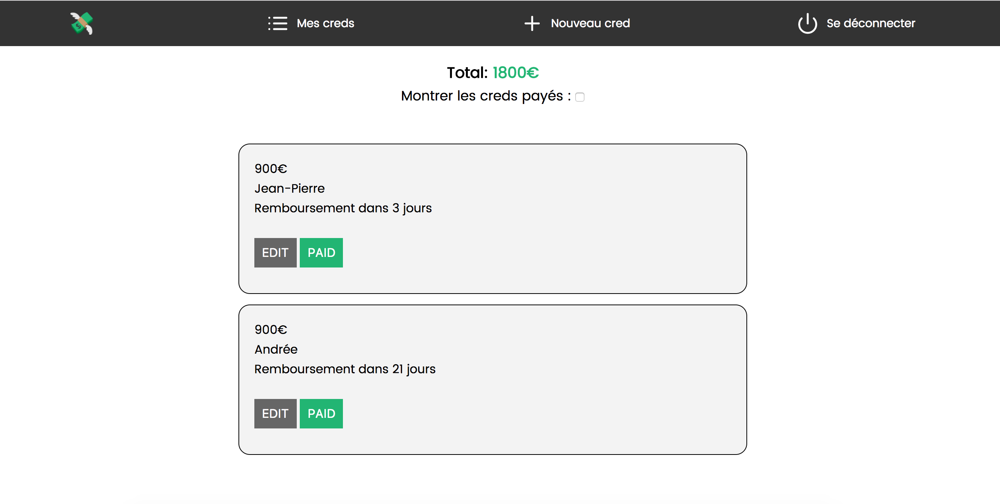

<h1 align="center">
  <br>
  <a href="https://yencli.com/"></a>
  <br>
  Yencli
  <br>
</h1>

<h4 align="center">The first CRM for drug dealers.</h4>

<br>



## Key Features

* Write and edit debts
* Manage your refund dates
* All of your debts sync with all your devices


## How To Use

To clone and run this application, you'll need [Git](https://git-scm.com) and [Node.js](https://nodejs.org/en/download/) (which comes with [npm](http://npmjs.com)) installed on your computer. From your command line:

```bash
# Clone this repository
$ git clone https://github.com/Dokeezy/yencli.git

# Go into the repository
$ cd yencli

# Install dependencies
$ npm install

# Run the app
$ npm run dev
```

## Credits

This software uses code from several open source packages.

- [Node.js](https://nodejs.org/)
- [Vue.js](https://vuejs.org/)
- [Firebase](https://firebase.google.com/)

#### License

MIT

---

> GitHub [@dokeezy](https://github.com/Dokeezy) &nbsp;&middot;&nbsp;
> Facebook [Pierre-Eric Garcia](https://www.facebook.com/pierreeric.garcia.1) &nbsp;&middot;&nbsp;
> LinkedIn [Pierre-Eric Garcia](https://www.linkedin.com/in/pierre-eric-garcia) &nbsp;&middot;&nbsp;
> Medium [@garciape](https://medium.com/@garciape)
